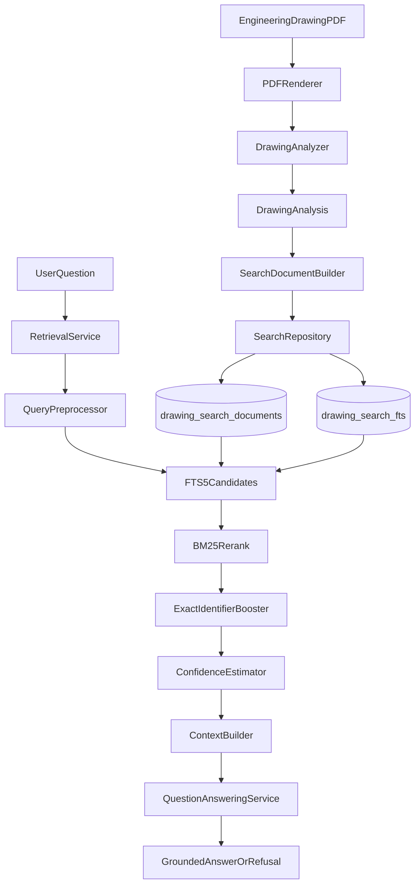
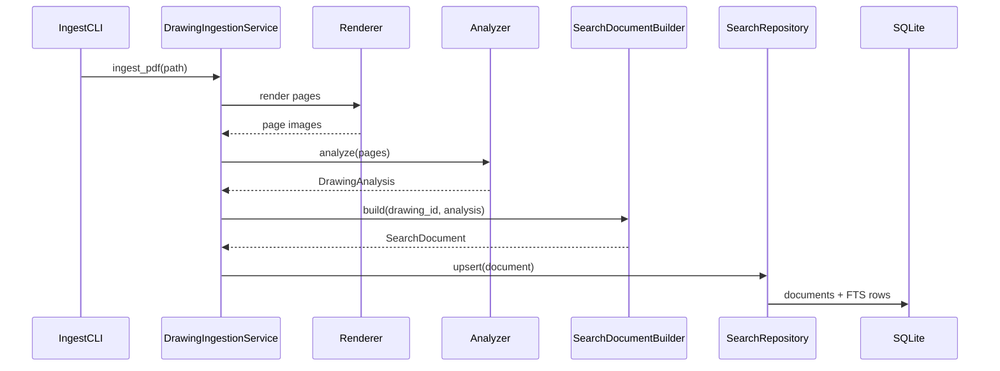
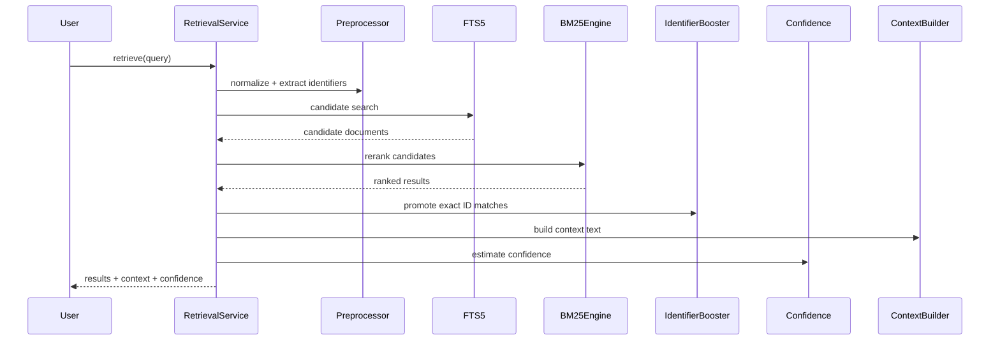
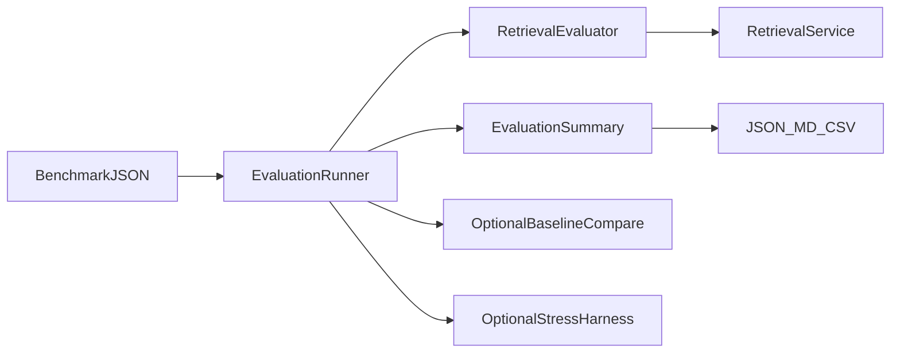

# Architecture Guide

Conceptual architecture for the Engineering Drawing Intelligence proof of concept.

This document describes **how major pieces fit together**. It does not duplicate API reference or CLI flags (see the root [`README.md`](README.md)).

---

## High-level architecture



---

## Component overview

| Layer | Components | Responsibility |
|-------|------------|----------------|
| Ingestion | `app.renderer`, `app.analyzer`, `SearchDocumentBuilder`, `DrawingIngestionService` | Turn PDFs into structured, searchable documents |
| Storage | `SearchDatabase`, `SearchRepository` | Persist documents and maintain FTS5 index |
| Retrieval | preprocessor, FTS, BM25, identifier boost, confidence, context | Select and explain evidence for a question |
| Answering | prompt builder, answer generator, QA service | Grounded LLM answers or safe refusal |
| Validation | evaluation package, dataset/regression/stress CLIs | Measure quality without changing ranking |
| Observability | traces, diagnostics, health/reindex | Explain and inspect retrieval for developers |

---

## Data ingestion flow



Notes:

- `drawing_id` is derived from PDF content hash (stable across re-ingest of the same file).
- Bulk ingest (`ingest_dataset.py`) repeats this loop over a directory.
- Offline golden packs can upsert prebuilt `SearchDocument` JSON without calling the analyzer.

---

## Retrieval flow



Important properties:

- Ranking quality is owned by FTS + BM25 + identifier **reordering**.
- Confidence and traces are additive observability; they do not re-score BM25.
- Empty or low-confidence evidence can short-circuit QA before an LLM call.

---

## Storage architecture

Two conceptual stores exist in the wider project history:

1. **Search index (primary for this PoC):** `data/drawing_search.db`
   - `drawing_search_documents` — structured searchable fields
   - `drawing_search_fts` — FTS5 virtual table for candidate retrieval
2. **Optional / experimental rich DB & vectors:** under `app/storage*` and `scripts/`
   - Not required for the lexical Q&A path described in the README
   - Reserved for later semantic / Hermes work

Operational utilities:

- `rebuild_search_index.py` — rebuild/validate FTS from documents
- `retrieval_health_report.py` — index size, coverage, optional probe latency

---

## Evaluation pipeline



Evaluation measures Hit@k, MRR, latency, confidence distribution, FP/FN-style identifier misses, and category breakdowns. It can run **retrieval-only** without API credentials.

Golden fixtures live in `evaluation/datasets/`:

- `golden_seed_documents.json` — offline index seed
- `golden_retrieval_benchmark.json` — aligned questions

---

## How major components interact

```text
CLI / tests
   │
   ├─► DrawingIngestionService ──► SearchRepository ──► SQLite/FTS
   │
   ├─► RetrievalService ──► ContextBuilder ──► DrawingQuestionAnsweringService
   │         │                                         │
   │         └─ traces / confidence / logging          └─ LLM only if evidence OK
   │
   └─► EvaluationRunner / regression / stress ──► reports/
```

Design principles:

- **Thin CLIs** over services (easy to script and test).
- **Canonical schemas** (`DrawingAnalysis`, `SearchDocument`) at the boundaries.
- **Lexical-first retrieval** kept stable while docs, diagnostics, and validation tooling evolve around it.

---

## Out of scope (by design)

- Hermes / MCP product integration
- Embedding-based semantic retrieval and hybrid RRF
- Changing BM25 scoring or confidence weights as part of documentation milestones
