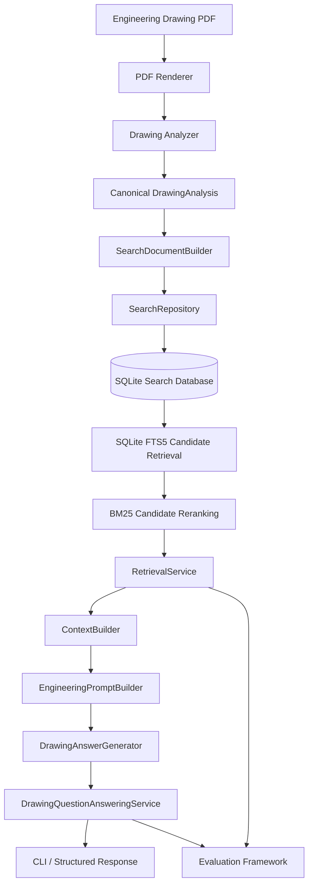

# Engineering Drawing Intelligence

Enterprise-oriented proof of concept for analysing engineering drawings, indexing extracted drawing knowledge, retrieving relevant evidence, and generating grounded answers through an OpenAI-compatible language model.

The system is designed around a clear separation of concerns:

- drawing ingestion and rendering;
- structured analysis;
- search-document construction;
- SQLite persistence;
- FTS5 candidate retrieval;
- BM25 reranking;
- context construction;
- grounded question answering;
- evaluation and regression testing.

> **Project status:** Milestones 1-6 complete. The current implementation includes ingestion, retrieval, grounded Q&A, CLI workflows, and an evaluation framework.

---

## Table of Contents

- [Overview](#overview)
- [Key Capabilities](#key-capabilities)
- [Architecture](#architecture)
- [Repository Structure](#repository-structure)
- [Technology Stack](#technology-stack)
- [Prerequisites](#prerequisites)
- [Installation](#installation)
- [Configuration](#configuration)
- [Ingesting a Drawing](#ingesting-a-drawing)
- [Asking Questions](#asking-questions)
- [Running Evaluations](#running-evaluations)
- [Public Service APIs](#public-service-apis)
- [Testing](#testing)
- [Security and Data Handling](#security-and-data-handling)
- [Operational Considerations](#operational-considerations)
- [Known Limitations](#known-limitations)
- [Development Workflow](#development-workflow)
- [Milestone Status](#milestone-status)
- [Future Enhancements](#future-enhancements)

---

## Overview

Engineering Drawing Intelligence converts engineering drawing files into structured, searchable knowledge.

A drawing is rendered, analysed, transformed into a canonical `DrawingAnalysis`, and indexed as a `SearchDocument`. Questions are processed through a two-stage retrieval pipeline:

1. SQLite FTS5 retrieves a focused candidate set.
2. BM25 reranks those candidates using engineering-aware tokenisation.

The highest-ranked evidence is formatted into a bounded context and passed to an OpenAI-compatible model. The model is instructed to answer only from the retrieved drawing evidence and to refuse unsupported questions.

The project intentionally avoids unnecessary orchestration frameworks. It does not depend on LangChain, LlamaIndex, vector databases, or agent runtimes.

---

## Key Capabilities

### Drawing ingestion

- PDF rendering through PyMuPDF.
- Structured drawing analysis.
- Canonical Pydantic schemas.
- Deterministic drawing identifiers based on file content.
- Search-document generation from structured engineering fields.
- SQLite-backed persistence.

### Engineering-aware retrieval

- SQLite FTS5 candidate search.
- Candidate-scoped BM25 reranking.
- Preservation of engineering identifiers such as:
  - `6061-T6`
  - `ISO-2768`
  - `BR-1001`
  - `M12x1.75`
  - `+/-0.02`
- Natural-language query preprocessing.
- Structured result metadata and separate FTS/BM25 scores.

### Grounded question answering

- Retrieval-first answer generation.
- No LLM call when no evidence is available.
- Prompt-injection resistance for instructions embedded in retrieved text.
- Exact preservation of engineering notation, units, revisions, tolerances, and standards.
- Source references using drawing number, revision, and filename.
- Human-readable and JSON CLI output.

### Evaluation and regression testing

- JSON benchmark datasets.
- Hit@1, Hit@3, Hit@5, and mean reciprocal rank.
- Answer-term recall.
- Source accuracy.
- Refusal accuracy.
- Grounded-response rate.
- Mean and p95 latency.
- JSON and Markdown reports.
- Threshold-based CLI exit codes for CI workflows.

---

## Architecture



### Retrieval flow

```text
Question
  -> NLTKProcessor
  -> SQLite FTS5 candidate retrieval
  -> BM25 reranking over candidate documents only
  -> ContextBuilder
  -> structured retrieval result
```

### Question-answering flow

```text
Question
  -> RetrievalService
  -> EngineeringPromptBuilder
  -> DrawingAnswerGenerator
  -> DrawingQuestionAnsweringService
  -> grounded answer and source metadata
```

---

## Repository Structure

```text
engineering-drawing-poc/
├── app/
│   ├── analyzer.py
│   ├── config.py
│   ├── renderer.py
│   └── schemas.py
├── search/
│   ├── context/
│   │   └── context_builder.py
│   ├── engines/
│   │   ├── search_engine.py
│   │   └── bm25_engine.py
│   ├── models/
│   │   └── search_document.py
│   ├── prompts/
│   │   └── engineering_prompt.py
│   ├── repositories/
│   │   └── search_repository.py
│   ├── services/
│   │   ├── drawing_ingestion_service.py
│   │   ├── nltk_processor.py
│   │   ├── retrieval_service.py
│   │   ├── answer_generator.py
│   │   └── question_answering_service.py
│   └── database.py
├── evaluation/
│   ├── datasets/
│   │   └── sample_benchmark.json
│   ├── evaluators/
│   ├── reporting/
│   ├── services/
│   ├── schemas.py
│   ├── dataset_loader.py
│   ├── metrics.py
│   └── README.md
├── tests/
│   ├── evaluation/
│   ├── integration/
│   └── search/
├── ingest_drawing.py
├── ask_drawing.py
├── evaluate_drawings.py
├── requirements.txt
├── .env.example
└── README.md
```

---

## Technology Stack

| Area | Technology |
|---|---|
| Language | Python 3.11+ |
| Validation | Pydantic |
| PDF rendering | PyMuPDF |
| Search database | SQLite |
| Lexical retrieval | SQLite FTS5 |
| Reranking | `rank-bm25` |
| Text processing | NLTK Snowball stemmer |
| LLM interface | OpenAI-compatible Python client |
| Testing | pytest |
| Reporting | JSON and Markdown |

---

## Prerequisites

- Python 3.11 or later.
- A virtual environment is strongly recommended.
- SQLite build with FTS5 support.
- An OpenAI-compatible endpoint for drawing analysis and answer generation.
- API credentials supplied through environment variables.

Confirm FTS5 support:

```bash
python -c "import sqlite3; print(sqlite3.sqlite_version)"
```

---

## Installation

### Windows PowerShell

```powershell
cd C:\Users\azureuser\Desktop\engineering-drawing-poc

python -m venv .venv
.\.venv\Scripts\Activate.ps1

python -m pip install --upgrade pip
pip install -r requirements.txt
```

### Linux or macOS

```bash
python -m venv .venv
source .venv/bin/activate

python -m pip install --upgrade pip
pip install -r requirements.txt
```

---

## Configuration

Copy the example environment file:

```powershell
Copy-Item .env.example .env
```

Configure the variables required by the current environment:

```dotenv
OPENAI_API_KEY=
OPENAI_BASE_URL=
OPENAI_MODEL=
OPENAI_ANSWER_MODEL=
```

### Variable behaviour

| Variable | Purpose |
|---|---|
| `OPENAI_API_KEY` | Authentication for the configured OpenAI-compatible endpoint |
| `OPENAI_BASE_URL` | Base URL for the model endpoint |
| `OPENAI_MODEL` | Default model used by the project |
| `OPENAI_ANSWER_MODEL` | Optional text-answering model; falls back to `OPENAI_MODEL` |

Database and data-directory defaults are defined in `app/config.py` and may be overridden according to the project's existing configuration conventions.

> Never commit `.env`, credentials, private endpoints, drawings, rendered pages, or generated databases.

---

## Ingesting a Drawing

Use the ingestion CLI to analyse and index a drawing:

```powershell
python ingest_drawing.py "C:\path\to\drawing.pdf"
```

The ingestion pipeline:

1. validates the input path;
2. computes a SHA-256 drawing identifier;
3. renders PDF pages;
4. performs structured analysis;
5. builds a search document;
6. upserts the record into SQLite and FTS5.

The search document includes structured metadata such as:

- drawing number;
- revision;
- title;
- material;
- finish;
- units;
- part numbers;
- dimensions;
- tolerances and GD&T;
- notes;
- searchable text;
- analysis version.

---

## Asking Questions

### Basic usage

```powershell
python ask_drawing.py "What material is specified for BR-1001?"
```

Example output:

```text
Answer:
The specified material is aluminium alloy 6061-T6.

Sources:
1. BR-1001 Rev B - bracket.pdf
```

### JSON output

```powershell
python ask_drawing.py `
  "What material is specified for BR-1001?" `
  --json
```

### Show retrieved context

```powershell
python ask_drawing.py `
  "What tolerance standard applies to BR-1001?" `
  --show-context
```

### Override retrieval parameters

```powershell
python ask_drawing.py `
  "Which drawing specifies 6061-T6?" `
  --database data\drawing_search.db `
  --candidate-limit 30 `
  --top-k 5 `
  --max-context-characters 16000
```

### No-evidence behaviour

When no indexed evidence is available, the service does not call the LLM and returns:

```text
The available indexed drawing context does not contain enough information to answer this question.
```

---

## Running Evaluations

Milestone 6 provides deterministic evaluation of retrieval, answer content, source accuracy, refusals, and latency.

### Retrieval-only evaluation

Retrieval-only mode does not require API credentials:

```powershell
python evaluate_drawings.py `
  --dataset evaluation\datasets\sample_benchmark.json `
  --database data\drawing_search.db
```

### Include answer evaluation

```powershell
python evaluate_drawings.py `
  --dataset evaluation\datasets\sample_benchmark.json `
  --database data\drawing_search.db `
  --evaluate-answers
```

### Write JSON and Markdown reports

```powershell
python evaluate_drawings.py `
  --dataset evaluation\datasets\sample_benchmark.json `
  --database data\drawing_search.db `
  --output-json reports\evaluation.json `
  --output-markdown reports\evaluation.md
```

### Regression thresholds

```powershell
python evaluate_drawings.py `
  --dataset evaluation\datasets\sample_benchmark.json `
  --database data\drawing_search.db `
  --fail-below-hit-at-1 0.80 `
  --fail-below-hit-at-5 0.95 `
  --fail-below-mrr 0.85 `
  --fail-on-case-error
```

The CLI returns a non-zero exit code when a configured threshold is not met, making it suitable for CI regression gates once the benchmark has been calibrated.

### Metrics

| Metric | Meaning |
|---|---|
| Hit@1 | Correct drawing appears at rank 1 |
| Hit@3 | Correct drawing appears in the top 3 |
| Hit@5 | Correct drawing appears in the top 5 |
| MRR | Mean reciprocal rank of the first correct result |
| Answer term recall | Expected answer terms found in the generated answer |
| Source accuracy | Returned sources match expected drawing identifiers |
| Refusal accuracy | Unsupported questions are correctly refused |
| Grounded-response rate | Responses generated with retrieved evidence |
| Mean latency | Average execution latency |
| p95 latency | 95th-percentile execution latency |

See [`evaluation/README.md`](evaluation/README.md) for benchmark schema and authoring guidance.

---

## Public Service APIs

### RetrievalService

```python
from search.services.retrieval_service import RetrievalService

result = retrieval_service.retrieve(
    query="What material is specified for BR-1001?",
    candidate_limit=30,
    top_k=5,
    max_context_characters=16000,
)
```

Response shape:

```python
{
    "query": str,
    "candidate_count": int,
    "result_count": int,
    "results": list[dict],
    "context": str,
}
```

### DrawingQuestionAnsweringService

```python
response = qa_service.answer(
    question="What material is specified for BR-1001?",
    candidate_limit=30,
    top_k=5,
    max_context_characters=16000,
)
```

Response shape:

```python
{
    "question": str,
    "answer": str,
    "grounded": bool,
    "candidate_count": int,
    "result_count": int,
    "sources": list[dict],
    "context": str,
}
```

### EvaluationRunner

```python
result = runner.run(
    dataset=dataset,
    evaluate_answers=False,
    default_candidate_limit=30,
    default_top_k=5,
    default_max_context_characters=16000,
)
```

---

## Testing

Run the complete test suite:

```powershell
pytest -q
```

Compile all source files:

```powershell
python -m compileall app search evaluation tests ask_drawing.py evaluate_drawings.py
```

Current validated project state:

```text
97 tests passed
```

Test coverage includes:

- search repository integration;
- SQLite FTS5 behaviour;
- BM25 candidate reranking;
- engineering identifier preservation;
- retrieval orchestration;
- bounded context construction;
- prompt construction;
- answer generation with injected clients;
- no-evidence LLM bypass;
- question-answering integration;
- benchmark schema validation;
- retrieval and answer metrics;
- refusal evaluation;
- report generation;
- evaluation CLI behaviour;
- real temporary SQLite integration tests.

Tests do not make live model API calls.

---

## Security and Data Handling

This repository is designed for engineering environments where drawings and metadata may be confidential.

### Security principles

- Secrets are loaded from environment variables.
- API keys are never printed or returned.
- Full prompts and proprietary context are not logged by default.
- Retrieval-only evaluation does not initialise the LLM client.
- SQL queries use parameterised statements.
- Retrieved drawing text is treated as untrusted data, not instructions.
- Prompt instructions explicitly reject commands embedded inside drawing content.
- No fallback answer is fabricated when an API call fails.
- No LLM call is made when retrieval produces no evidence.

### Files that must not be committed

- `.env`
- API keys and tokens
- private endpoint URLs
- SQLite database files
- engineering drawings
- rendered drawing images
- analysis logs
- generated reports containing confidential information
- virtual environments
- temporary files

The project `.gitignore` already excludes common generated evaluation outputs such as `reports/` and `evaluation/results/`.

---

## Operational Considerations

### Database separation

The project intentionally separates operational drawing analysis storage from search indexing where configured. This avoids coupling the canonical analysis registry to retrieval-specific storage and enables either layer to evolve independently.

### FTS5 score semantics

SQLite FTS5 `bm25()` scores are ordered with lower values representing stronger matches. Python BM25 reranking uses higher scores for stronger matches. The project preserves these as separate fields:

- `fts_score`
- `bm25_score`

They should not be compared directly or combined without explicit normalisation.

### Candidate-scoped reranking

BM25 indexes only the FTS5 candidate set during retrieval. This avoids rebuilding a BM25 index over the full document corpus for every query and keeps the architecture suitable for larger indexes.

### Context budget

The `ContextBuilder` enforces a maximum character budget. Higher-ranked documents are included first, and oversized content is truncated with an explicit marker.

---

## Known Limitations

- FTS5 query construction uses heuristic token handling and may require further refinement for complex operators or unusual notation.
- OR-based natural-language FTS queries may produce broad candidate sets on very large indexes.
- Deterministic answer-term evaluation is sensitive to paraphrasing.
- The sample benchmark is a template and must be aligned with actual indexed drawings before its metrics are meaningful.
- Very small context budgets may truncate a structured field mid-value.
- A vision-oriented default model may not be ideal for text-only Q&A; configure `OPENAI_ANSWER_MODEL` where needed.
- The current system uses lexical retrieval only. It does not yet include semantic embeddings or a cross-encoder reranker.
- The answer is grounded in retrieved evidence, but the system does not independently verify every generated sentence after generation.

---

## Development Workflow

Recommended branch workflow:

```text
main
  -> feature branch
  -> implementation
  -> compile check
  -> pytest
  -> evaluation smoke test
  -> review
  -> pull request
```

Before committing:

```powershell
python -m compileall app search evaluation tests ask_drawing.py evaluate_drawings.py
pytest -q
git diff --check
git status
```

Confirm that no secrets, databases, drawings, rendered images, logs, or generated confidential reports are staged.

---

## Milestone Status

| Milestone | Scope | Status |
|---|---|---|
| 1 | Core infrastructure and project foundation | Complete |
| 2 | Drawing rendering and structured analysis | Complete |
| 3 | Search indexing and persistence | Complete |
| 4 | Clean architecture refactor | Complete |
| 5 | Grounded retrieval and question answering | Complete |
| 6 | Evaluation and benchmarking framework | Complete |

---

## Future Enhancements

Future work should be driven by benchmark results rather than added by default.

Potential enhancements include:

- field-aware search weighting;
- structured filters for revision, material, units, and drawing number;
- query-intent classification;
- improved FTS escaping and engineering symbol normalisation;
- learned reranking;
- semantic embeddings for concept-heavy queries;
- citation spans tied to exact extracted fields;
- comparison across multiple drawings or revisions;
- REST API and enterprise authentication;
- centralised audit logging;
- access control by drawing or project;
- Azure deployment and operational monitoring;
- CI regression gates based on calibrated benchmark thresholds.

---

## Enterprise Readiness Summary

The current implementation provides a strong PoC foundation with:

- modular service boundaries;
- deterministic ingestion and retrieval;
- engineering-aware lexical search;
- grounded answer generation;
- explicit no-evidence behaviour;
- repeatable evaluation metrics;
- integration and CLI test coverage;
- secrets-safe configuration;
- minimal framework dependency;
- a clear path towards controlled enterprise deployment.

Before production deployment, complete a security review, establish access controls, calibrate a real benchmark dataset, validate model-provider data handling, implement operational monitoring, and define retention policies for drawings, extracted data, prompts, answers, and reports.

---

## Licence

Add the approved project licence before external distribution.

For internal enterprise use, confirm ownership, confidentiality, third-party dependency obligations, and distribution restrictions with the relevant legal and security teams.
